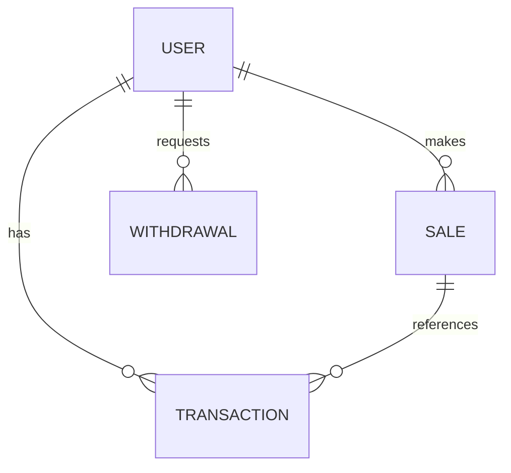

# User Payout Management System (LLD)

This is a comprehensive Low-Level Design (LLD) and working implementation for a **User Payout Management System** built with **Node.js, Express, and MongoDB (Mongoose)**, utilizing **ES Modules** and strict atomic transactional logic.

---

## 📁 1. System Architecture & Folder Structure

The project follows a clean **Controller-Service-Model** pattern to ensure separation of concerns, testability, and modularity.

```text
user_payout_system/
├── src/
│   ├── config/
│   │   └── db.js                 # MongoDB connection setup
│   ├── constants/                # Centralized enums to prevent magic strings
│   │   ├── brands.js
│   │   ├── saleStatus.js
│   │   ├── transactionTypes.js
│   │   └── withdrawalStatus.js
│   ├── controllers/              # Request & response handlers
│   │   ├── adminController.js
│   │   ├── payoutController.js
│   │   ├── saleController.js
│   │   ├── userController.js
│   │   └── withdrawalController.js
│   ├── models/                   # Mongoose Database schemas
│   │   ├── Sale.js
│   │   ├── Transaction.js
│   │   ├── User.js
│   │   └── Withdrawal.js
│   ├── routes/                   # Express routes definition
│   │   ├── adminRoutes.js
│   │   ├── payoutRoutes.js
│   │   ├── saleRoutes.js
│   │   ├── userRoutes.js
│   │   └── withdrawalRoutes.js
│   ├── services/                 # Core business & transactional logic
│   │   ├── payoutService.js
│   │   ├── reconciliationService.js
│   │   ├── saleService.js
│   │   └── withdrawalService.js
│   ├── app.js                    # Express app initialization & middleware mounting
│   └── server.js                 # App entry point (boots server & DB connection)
├── .env                          # Environment configurations
├── .gitignore
├── package.json
└── README.md
```

---

## 🗄️ 2. Database Schema Design & Relationships

The database consists of four primary collections. To guarantee ledger consistency, the relationships are structured as follows:



### 1. `User` Schema
Tracks the user’s balances and metrics.
*   `username` (String, required, unique, indexed)
*   `email` (String, unique, sparse)
*   `walletBalance` (Number, default: 0): Represents the user's withdrawable balance.
*   `totalAdvanceReceived` (Number, default: 0)
*   `totalFinalPayoutReceived` (Number, default: 0)

### 2. `Sale` Schema
Represents the affiliate sales.
*   `userId` (ObjectId, ref: 'User', required, indexed)
*   `brand` (String, enum: `["brand_1", "brand_2", "brand_3"]`, required)
*   `status` (String, enum: `["pending", "approved", "rejected"]`, default: `"pending"`, indexed)
*   `earning` (Number, required, min: 0): The total earnings of the sale.
*   `advancePaid` (Boolean, default: false, indexed): Tracks if the 10% advance payout was processed.
*   `advanceAmount` (Number, default: 0): The exact amount paid as an advance.
*   `reconciled` (Boolean, default: false): Tracks if an admin has processed/reconciled the sale.

### 3. `Withdrawal` Schema
Tracks user withdrawal requests.
*   `userId` (ObjectId, ref: 'User', required, indexed)
*   `amount` (Number, required, min: 1)
*   `status` (String, enum: `["pending", "success", "failed", "cancelled", "rejected"]`, default: `"pending"`, indexed)
*   `initiatedAt` (Date, default: Date.now)

### 4. `Transaction` Schema
The financial ledger tracking all balance movements (Credits & Debits).
*   `userId` (ObjectId, ref: 'User', required, indexed)
*   `saleId` (ObjectId, ref: 'Sale', default: null): Optional, references the related sale for advance/final payouts.
*   `type` (String, enum: `["advance", "final_payout", "adjustment", "withdrawal", "withdrawal_refund"]`, required)
*   `transactionType` (String, enum: `["credit", "debit"]`, required)
*   `amount` (Number, required, min: 0)
*   `status` (String, enum: `["pending", "success", "failed"]`, default: `"success"`)
*   `description` (String)

---

## ⚡ 3. Key Design Decisions & Trade-Offs

1.  **Decoupled Job-Based Advance Payouts:**
    Instead of paying out the 10% advance payout immediately upon sale creation, the system delegates this to a separate payout service (`processAdvancePayout`). This allows the system to process payouts in bulk as a background cron job. It aligns perfectly with the assignment's rule: *"even if the advance payout job runs multiple times."*
2.  **Mongoose Transactions (ACID compliance):**
    All state changes that modify a user's balance and create a transaction log (e.g., Advance Payout, Reconciliation, Withdrawals, and Refunds) are wrapped in **MongoDB Session Transactions**. If any write fails (e.g., database connection drops midway), the entire operation is rolled back, preventing balance discrepancies.
3.  **Centralized Enums (Clean Code Architecture):**
    All status, brands, and transaction type strings are centralized inside the `src/constants/` folder. This eliminates magic strings and ensures single-point-of-change updates across models, routes, and controllers.

---

## 🛡️ 4. Handling of Edge Cases & Failure Scenarios

*   **Double Advance Payout Prevention:**
    The implementation ensures idempotency by processing only sales whose `advancePaid` flag is `false`. Combined with MongoDB transactions, this prevents duplicate payouts during normal execution.
*   **Negative Balance Recovery:**
    The current implementation allows temporary negative balances so rejected advances can be recovered correctly. In production, this could instead be managed through a dedicated debt or settlement mechanism.
*   **24-Hour Withdrawal Restriction:**
    Before executing a withdrawal, the system queries the last withdrawal request for the user sorted by date. It checks `Date.now() - lastWithdrawal.createdAt` and blocks the transaction if the difference is less than 24 hours.
*   **Double-Refund Prevention (Failed Payout Recovery):**
    For Question 2, when marking a withdrawal as `failed`, `cancelled`, or `rejected`, the system enforces a guard check: `withdrawal.status === WITHDRAWAL_STATUS.PENDING`. Once resolved, its status changes, blocking any subsequent refund calls.

---

## 🌐 5. API Endpoints Documentation

### **Users**
*   **`POST /api/users`** - Creates a new user.
    *   *Request Body:* `{ "username": "john_doe", "email": "john@example.com" }`
*   **`GET /api/users`** - Retrieves all users.

### **Sales**
*   **`POST /api/sales`** - Creates a sale (defaults to status `"pending"`).
    *   *Request Body:* `{ "userId": "USER_ID", "brand": "brand_1", "earning": 40 }`
*   **`GET /api/sales`** - Retrieves all sales (populates user details).

### **Payouts**
*   **`POST /api/payouts/advance`** - Triggers the advance payout job. Processes all eligible pending sales (10% earnings credit).
    *   *Response:* `{ "success": true, "message": "...", "data": { "processed": 1 } }`

### **Admin Reconciliation**
*   **`POST /api/admin/reconcile`** - Admin reconciles sales.
    *   *Request Body:*
        ```json
        {
          "sales": [
            { "saleId": "SALE_ID_1", "status": "approved" },
            { "saleId": "SALE_ID_2", "status": "rejected" }
          ]
        }
        ```

### **Withdrawals**
*   **`POST /api/withdrawals`** - Initiates a withdrawal (enforces 24h limit & balance check).
    *   *Request Body:* `{ "userId": "USER_ID", "amount": 10 }`
*   **`POST /api/withdrawals/recover`** - Triggers Failed Payout Recovery (Question 2). Updates status to `failed`, `cancelled`, or `rejected` and refunds user.
    *   *Request Body:* `{ "withdrawalId": "WITHDRAWAL_ID", "status": "failed" }`

---

## 🚀 6. Getting Started & Running Locally

1.  **Clone the repository.**
2.  **Install dependencies:**
    ```bash
    npm install
    ```
3.  **Setup environment variables (`.env`):**
    ```env
    PORT=5000
    MONGO_URI=your_mongodb_connection_uri
    ```
4.  **Run in Development Mode:**
    ```bash
    npm run dev
    ```

---

## 🛠️ 7. Future Improvements

*   **Authentication & Authorization (JWT)**
*   **Scheduled Cron Job for Advance Payout**
*   **Pagination & Filtering APIs**
*   **Swagger API Documentation**
*   **Unit & Integration Tests**
*   **Docker Support**
*   **CI/CD Pipeline**
